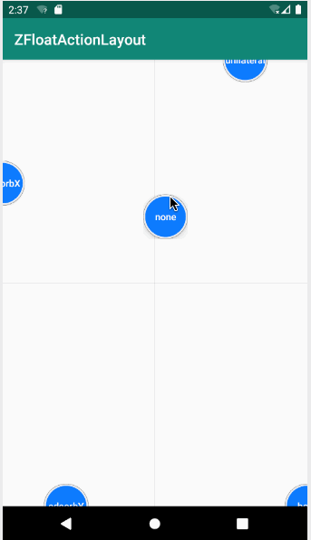
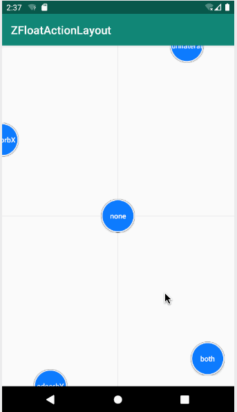
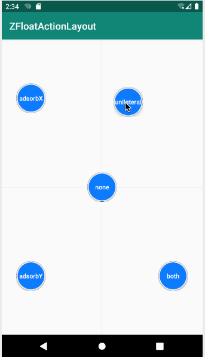
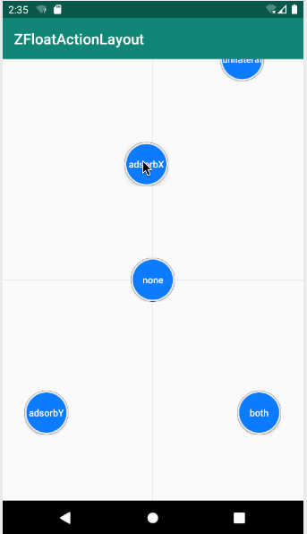
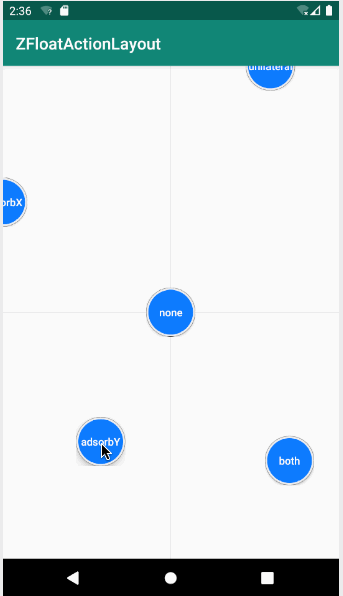

# ZFloatActionLayout

 自定义 随意拖动 + 吸边 + 半隐藏 布局，继承自 RelativeLayout ，可装载任何子控件

 属性：

      <declare-styleable name="ZFloatActionLayout">
          //吸边模式
          //none: 默认模式没有吸边
          //both: X轴和Y轴同时吸边
          //unilateral: 单边模式，X轴和Y轴哪个轴距离边界近就吸哪个轴
          //adsorbX: 只有X轴吸边
          //adsorbY: 只有Y轴吸边
          <attr name="ZFloatActionLayout_adsorbMode" format="enum">
              <enum name="none" value="0"/>
              <enum name="both" value="1"/>
              <enum name="unilateral" value="2"/>
              <enum name="adsorbX" value="3"/>
              <enum name="adsorbY" value="4"/>
          </attr>

          //X轴吸边之后与边缘的距离
          <attr name="ZFloatActionLayout_adsorbXMargin" format="dimension"/>
          //Y轴吸边之后与边缘的距离
          <attr name="ZFloatActionLayout_adsorbYMargin" format="dimension"/>
          //是否开启半隐藏
          <attr name="ZFloatActionLayout_isHalfHidden" format="boolean"/>
          //显示多少时间后进行隐藏（单位：毫秒）
          <attr name="ZFloatActionLayout_displayDuration" format="integer"/>
          //计时间隔（单位：毫秒）
          <attr name="ZFloatActionLayout_displayStep" format="integer"/>
      </declare-styleable>

 使用：

    <com.zhumj.zfloatactionlayout.ZFloatActionLayout
            android:layout_width="60dp"
            android:layout_height="60dp"
            app:ZFloatActionLayout_adsorbMode="none"
            app:ZFloatActionLayout_adsorbXMargin="12dp"
            app:ZFloatActionLayout_adsorbYMargin="12dp"
            app:ZFloatActionLayout_isHalfHidden="true"
            app:ZFloatActionLayout_displayDuration="10000"
            app:ZFloatActionLayout_displayStep="1000"
            app:layout_constraintRight_toRightOf="parent"
            app:layout_constraintTop_toTopOf="parent"
            app:layout_constraintLeft_toLeftOf="parent"
            app:layout_constraintBottom_toBottomOf="parent">

        <Button
                android:layout_width="match_parent"
                android:layout_height="match_parent"
                android:background="@drawable/shape_button_bg"
                android:onClick="onButtonClick"
                android:textColor="@android:color/white"
                android:textSize="13sp"
                android:gravity="center"
                android:textAllCaps="false"
                android:text="none"/>

    </com.zhumj.zfloatactionlayout.ZFloatActionLayout>

    <com.zhumj.zfloatactionlayout.ZFloatActionLayout
            android:layout_width="60dp"
            android:layout_height="60dp"
            app:ZFloatActionLayout_adsorbMode="both"
            app:ZFloatActionLayout_adsorbXMargin="12dp"
            app:ZFloatActionLayout_adsorbYMargin="12dp"
            app:ZFloatActionLayout_isHalfHidden="true"
            app:ZFloatActionLayout_displayDuration="10000"
            app:ZFloatActionLayout_displayStep="1000"
            app:layout_constraintRight_toRightOf="parent"
            app:layout_constraintTop_toTopOf="parent"
            app:layout_constraintLeft_toLeftOf="parent"
            app:layout_constraintBottom_toBottomOf="parent">

        <Button
                android:layout_width="match_parent"
                android:layout_height="match_parent"
                android:background="@drawable/shape_button_bg"
                android:onClick="onButtonClick"
                android:textColor="@android:color/white"
                android:textSize="13sp"
                android:gravity="center"
                android:textAllCaps="false"
                android:text="none"/>

    </com.zhumj.zfloatactionlayout.ZFloatActionLayout>

    <com.zhumj.zfloatactionlayout.ZFloatActionLayout
            android:layout_width="60dp"
            android:layout_height="60dp"
            app:ZFloatActionLayout_adsorbMode="unilateral"
            app:ZFloatActionLayout_adsorbXMargin="12dp"
            app:ZFloatActionLayout_adsorbYMargin="12dp"
            app:ZFloatActionLayout_isHalfHidden="true"
            app:ZFloatActionLayout_displayDuration="10000"
            app:ZFloatActionLayout_displayStep="1000"
            app:layout_constraintRight_toRightOf="parent"
            app:layout_constraintTop_toTopOf="parent"
            app:layout_constraintLeft_toLeftOf="parent"
            app:layout_constraintBottom_toBottomOf="parent">

        <Button
                android:layout_width="match_parent"
                android:layout_height="match_parent"
                android:background="@drawable/shape_button_bg"
                android:onClick="onButtonClick"
                android:textColor="@android:color/white"
                android:textSize="13sp"
                android:gravity="center"
                android:textAllCaps="false"
                android:text="none"/>

    </com.zhumj.zfloatactionlayout.ZFloatActionLayout>

    <com.zhumj.zfloatactionlayout.ZFloatActionLayout
            android:layout_width="60dp"
            android:layout_height="60dp"
            app:ZFloatActionLayout_adsorbMode="adsorbX"
            app:ZFloatActionLayout_adsorbXMargin="12dp"
            app:ZFloatActionLayout_adsorbYMargin="12dp"
            app:ZFloatActionLayout_isHalfHidden="true"
            app:ZFloatActionLayout_displayDuration="10000"
            app:ZFloatActionLayout_displayStep="1000"
            app:layout_constraintRight_toRightOf="parent"
            app:layout_constraintTop_toTopOf="parent"
            app:layout_constraintLeft_toLeftOf="parent"
            app:layout_constraintBottom_toBottomOf="parent">

        <Button
                android:layout_width="match_parent"
                android:layout_height="match_parent"
                android:background="@drawable/shape_button_bg"
                android:onClick="onButtonClick"
                android:textColor="@android:color/white"
                android:textSize="13sp"
                android:gravity="center"
                android:textAllCaps="false"
                android:text="none"/>

    </com.zhumj.zfloatactionlayout.ZFloatActionLayout>

    <com.zhumj.zfloatactionlayout.ZFloatActionLayout
            android:layout_width="60dp"
            android:layout_height="60dp"
            app:ZFloatActionLayout_adsorbMode="adsorbY"
            app:ZFloatActionLayout_adsorbXMargin="12dp"
            app:ZFloatActionLayout_adsorbYMargin="12dp"
            app:ZFloatActionLayout_isHalfHidden="true"
            app:ZFloatActionLayout_displayDuration="10000"
            app:ZFloatActionLayout_displayStep="1000"
            app:layout_constraintRight_toRightOf="parent"
            app:layout_constraintTop_toTopOf="parent"
            app:layout_constraintLeft_toLeftOf="parent"
            app:layout_constraintBottom_toBottomOf="parent">

        <Button
                android:layout_width="match_parent"
                android:layout_height="match_parent"
                android:background="@drawable/shape_button_bg"
                android:onClick="onButtonClick"
                android:textColor="@android:color/white"
                android:textSize="13sp"
                android:gravity="center"
                android:textAllCaps="false"
                android:text="none"/>

    </com.zhumj.zfloatactionlayout.ZFloatActionLayout>

